# 🐱 고용희 (HireHee) - 당신만의 취업 컨설턴트

> **"기업의 시선으로 나를 읽다"**  
> 성격 유형 기반 맞춤형 인재상 진단 서비스

 

  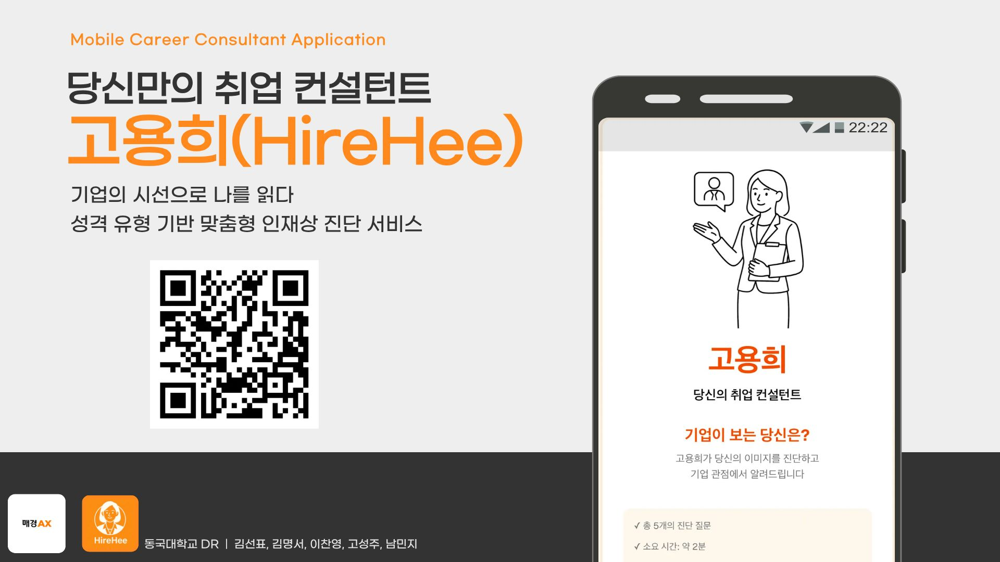
    
   
   
   
   

 

---

## 📌 프로젝트 소개 (About)

취업 정보는 넘쳐나지만, 정작 **“나에게 맞는 기업이 무엇인지”** 아는 것은 어렵습니다.  
기업이 중요하게 생각하는 인재상은 매년 바뀌고, 구직자 개인의 시선과 기업이 보는 시선 사이에는 큰 정보 비대칭이 존재합니다.

**고용희(HireHee)**는  
📌 기업의 인재상  
📌 매일경제 BigKinds 기업 기사 데이터  
📌 사용자 성향 분석  
📌 AI 기반 기업 관점 역매칭  
을 결합하여, **기업 입장에서 사용자를 해석**하는 새로운 방식의 진단 서비스를 제공합니다.

 

---

## 💡 기획 배경 (Background)

취업 시장에는 구직자와 기업 간의 **‘미스매치(Mismatch)’**가 존재합니다.

- **📉 스펙 중심 준비의 한계**  
  인사담당자 **79.7%**: *“스펙이 완벽해도 인재상이 맞지 않으면 탈락시킨다.”*
- **🧩 최신 트렌드 정보 부족**  
  구직자가 최신 인재상 경향을 파악하기 어려움
- **⚖️ 직무 적합성 강조**  
  구직자 **39.6%**: 회사 선택 기준 1순위가 ‘직무 적합성’

👉 고용희는 이러한 문제를 해결하기 위해 **기업 관점의 역매칭 서비스**를 제안합니다.

 

---

## ✨ 핵심 기능 (Key Features)

### 1. ⏱️ Easy – 초간단 성향 분석  
5개의 핵심 질문으로 성향을 파악 (약 2분 소요)

### 2. 📰 Objective – 데이터 기반 분석  
매일경제 기사 DB(BigKinds)의 실제 기사 텍스트 기반으로 기업 인재상을 추출

### 3. 🔄 Matching – 기업 관점 역매칭  
사용자의 성향이 *기업 입장에서* 어떤 이미지로 보이는지를 모델이 직접 해석하여 추천

 

---

## 📱 서비스 화면 (Preview)

### 1) 주요 화면 미리보기

| 메인 화면 | 개인정보 입력 | 성격 테스트 |
| :---: | :---: | :---: |
| 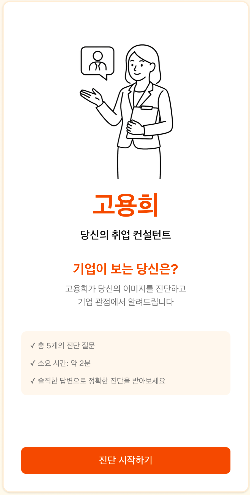 | 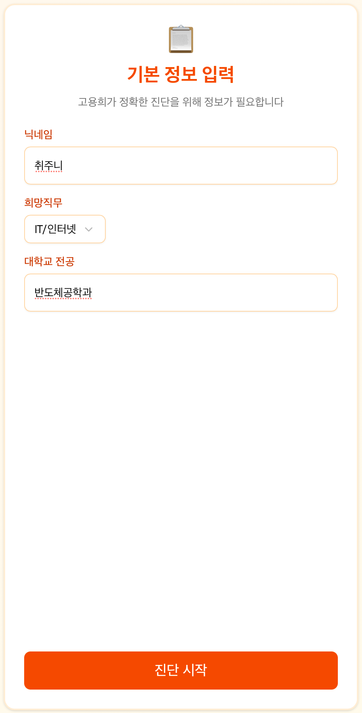 | 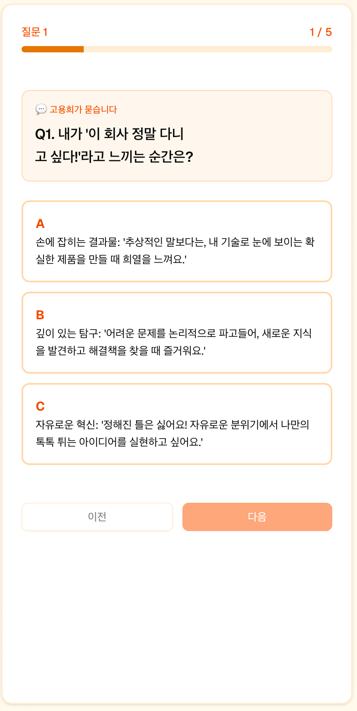 |

| 로딩 | 기업 추천 | 나의 강점 | 강점 설명 |
| :---: | :---: | :---: | :---: |
| 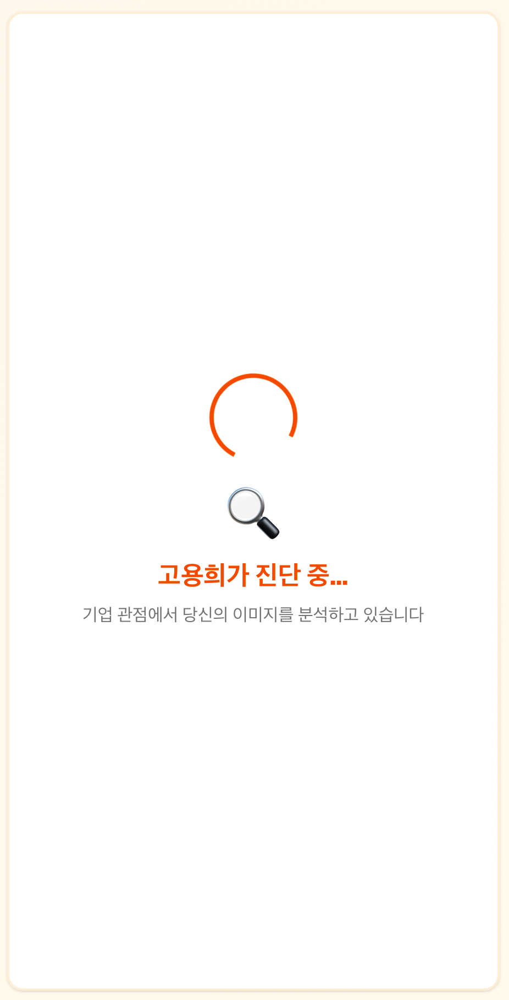 | 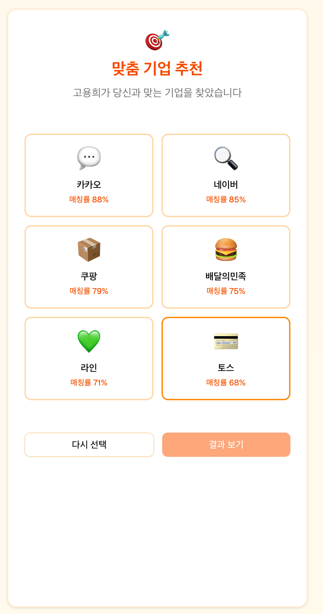 | 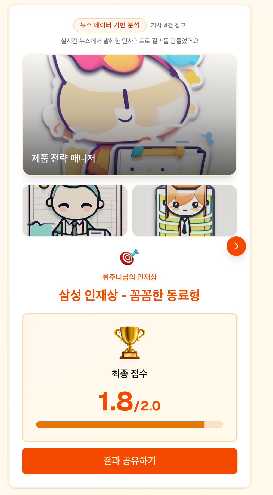 | 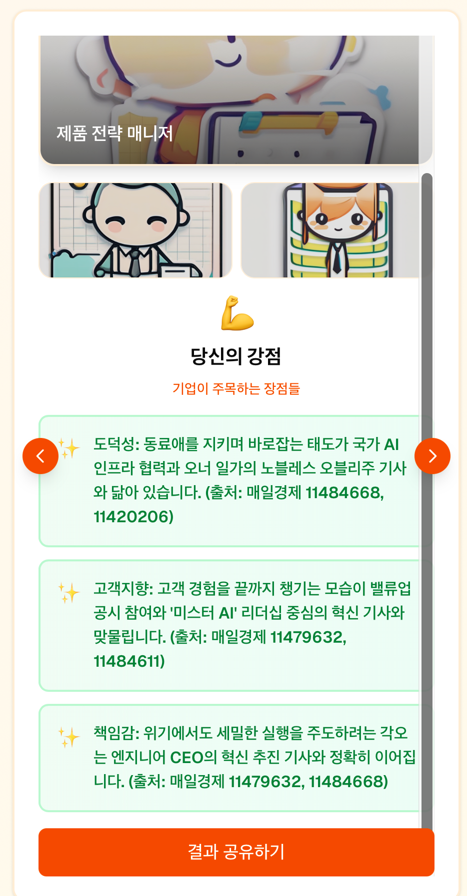 |

 

---

## 🎯 타겟 사용자 (Target Audience)

1. **대기업 지망생** — 조직 문화 적합성 확인  
2. **직무 고민형** — 성향 기반 직무 탐색  
3. **이직 준비러** — 자신에게 맞는 기업 문화 재탐색  
4. **취업 재도전생** — 반복되는 면접 탈락 원인 분석

 

---

## 🧠 기술 구조 (Architecture)

  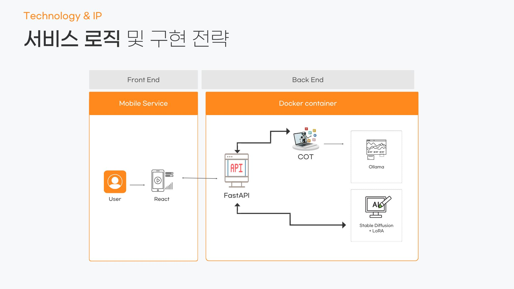

---

## 🛠️ 기술 스택 및 흐름

### 📱 Frontend — React Native
- 모바일 UI/UX 개발  
- 성향 테스트 및 추천 결과 화면 제공  

### ⚙️ Backend — FastAPI
- 사용자 응답 수집  
- AI 분석 API 제공  
- 기업 인재상 스코어링 로직 처리  

### 🧠 AI Layer (Docker 내부)
- **COT 기반 성향 분석 모델**  
  → 사용자 응답을 인재상 태그로 구조화  
- **Ollama + LLM**  
  → 기업 기사 기반 패턴 분석  
  → 기업 인재상 핵심 키워드 자동 추출  
- **Stable Diffusion + LoRA**  
  → 사용자 성향을 시각적 이미지로 표현하여 결과 전달  

### 📂 데이터 — BigKinds (매일경제 기사 DB)
- 최근 5년 기사 활용  
- 기업별 핵심 키워드 벡터 생성 및 통계 기반 인재상 분석  

 

## 👥 동국대학교 DR 팀 소개

| 김선표 **팀장 · 운영** | 김명서 **백엔드 · LLM** | 이찬영 **프론트 · 분석** | 고성주 **백엔드 · 이미지 생성** | 남민지 **기획 · 분석** |
| :---: | :---: | :---: | :---: | :---: |
| 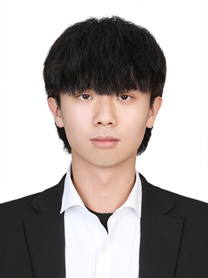 | *(이미지 업로드 예정)* | *(이미지 업로드 예정)* | *(이미지 업로드 예정)* |  |
| [@Roflaff](https://github.com/Roflaff) | [@Miiings](https://github.com/Miiings) | [@gitchanNot](https://github.com/gitchanNot) | [@Kseongju030307](https://github.com/Kseongju030307) | [@SouthMinji](https://github.com/SouthMinji) |

 

  

### 📱 앱 실행 QR 코드 

 
  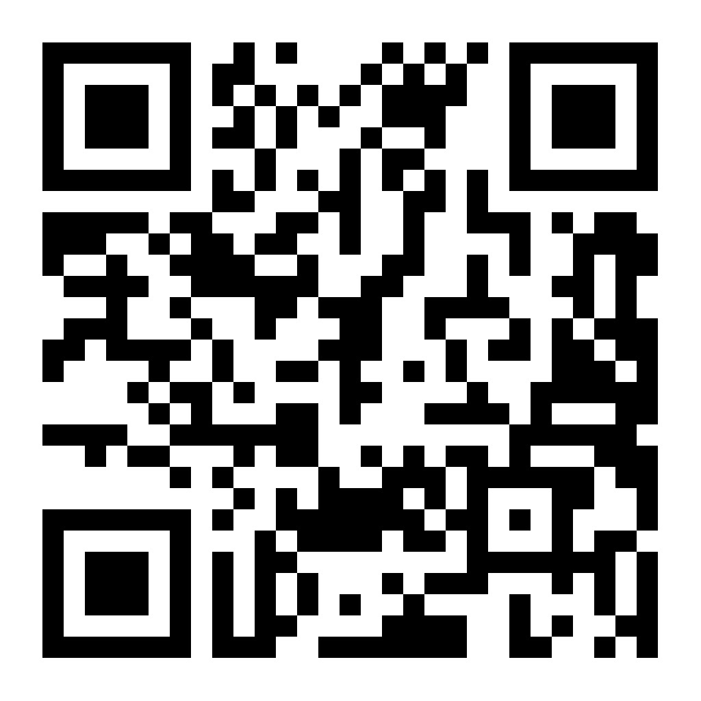 
 

## 📰 언론 보도 (Media Coverage) 
- 🎥 [유튜브 뉴스 보도](https://www.youtube.com/watch?v=uc0V85sc0k8)
- 📰 [매일경제 기사](https://www.mk.co.kr/news/economy/11485734)
